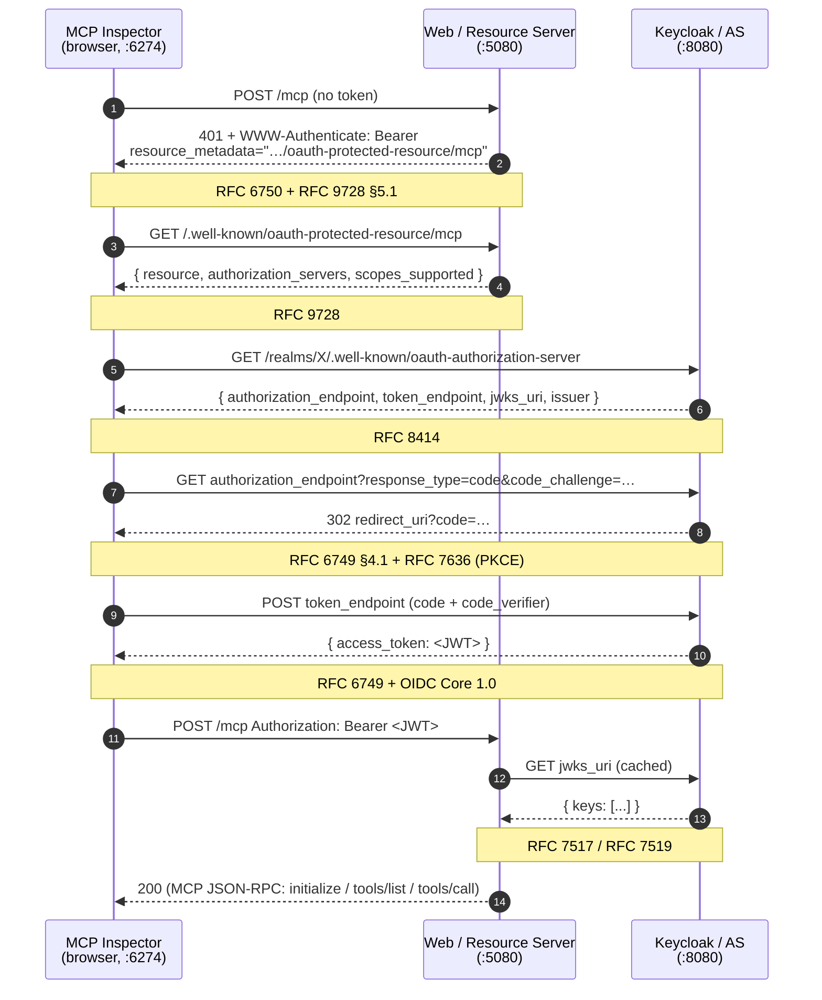

# Authentication & Authorization

The `Nall.Hangfire.Mcp` library is **auth-agnostic** — `MapHangfireMcp` returns an `IEndpointConventionBuilder`, so any ASP.NET Core auth scheme can be applied via `.RequireAuthorization(...)`. This document describes the `samples/Web` setup, the protocols involved, and where alternatives exist.

## Standards in play

| # | Spec | Role in this sample |
|---|---|---|
| 1 | [MCP Authorization (2025‑06‑18)](https://modelcontextprotocol.io/specification/2025-06-18/basic/authorization) | MCP server acts as an OAuth 2.1 **resource server**; auth is layered on, not built in |
| 2 | [RFC 9728 — OAuth 2.0 Protected Resource Metadata](https://datatracker.ietf.org/doc/html/rfc9728) | `/.well-known/oauth-protected-resource/mcp` advertises which AS issues tokens for `/mcp` |
| 3 | [RFC 6750 — Bearer Token Usage](https://datatracker.ietf.org/doc/html/rfc6750) | `Authorization: Bearer <jwt>` + `WWW-Authenticate` with `resource_metadata=` (RFC 9728 §5.1) |
| 4 | [RFC 8414 — OAuth 2.0 Authorization Server Metadata](https://datatracker.ietf.org/doc/html/rfc8414) | Client discovers Keycloak's `authorization_endpoint`, `token_endpoint`, `jwks_uri`, `issuer` |
| 5 | [RFC 7636 — PKCE](https://datatracker.ietf.org/doc/html/rfc7636) | Required for public clients (MCP Inspector, Swagger UI) |
| 6 | [RFC 6749 — OAuth 2.0 Authorization Code](https://datatracker.ietf.org/doc/html/rfc6749#section-4.1) + [OIDC Core 1.0](https://openid.net/specs/openid-connect-core-1_0.html) | Token issuance flow |
| 7 | [RFC 7519 — JWT](https://datatracker.ietf.org/doc/html/rfc7519) + [RFC 7517 — JWK](https://datatracker.ietf.org/doc/html/rfc7517) | Access token format + signing key distribution |
| 8 | [WHATWG Fetch / W3C CORS](https://fetch.spec.whatwg.org/) | Browser preflight on the cross-origin metadata fetch |

## End-to-end flow (MCP Inspector → `/mcp`)



### Step-by-step

**1. Unauthenticated `/mcp` request → RFC 9728-compliant challenge.**
`MapHangfireMcp("/mcp").RequireAuthorization(... AddAuthenticationSchemes(McpAuthenticationDefaults.AuthenticationScheme))` routes the challenge through the `McpAuthenticationHandler` (from `ModelContextProtocol.AspNetCore.Authentication`). That handler emits `WWW-Authenticate: Bearer resource_metadata="…"` instead of a plain `Bearer` challenge — the `resource_metadata` parameter is the RFC 9728 extension that lets clients discover the AS without out-of-band config.

> **Why a separate auth scheme?** The default JwtBearer challenge writes `WWW-Authenticate: Bearer error="…"` only — no `resource_metadata`. Clients that follow only RFC 6750 work; clients that follow MCP/RFC 9728 need the discovery pointer. We register both: JwtBearer **validates** tokens, McpAuthentication **challenges**. See `Program.cs:62‑72` and `Program.cs:241‑246`.

**2. Protected-resource-metadata discovery.**
`AddMcp(...)` registers an endpoint at `/.well-known/oauth-protected-resource/mcp` that returns:

```json
{
  "resource": "http://localhost:5080/mcp",
  "authorization_servers": ["http://localhost:8080/realms/HangfireMcp/"],
  "scopes_supported": ["openid", "profile"]
}
```

This is fetched **cross-origin** by the inspector's browser code (origin `http://localhost:6274` → `http://localhost:5080`), so a CORS policy is required (`Program.cs:78‑80`).

**3. Authorization server metadata (RFC 8414).**
The inspector hits `http://localhost:8080/realms/HangfireMcp/.well-known/oauth-authorization-server`. Keycloak 26.4+ exposes both this and the older `/.well-known/openid-configuration` (OIDC Discovery 1.0). RFC 8414 is the strictly OAuth-2.0-aligned one and is what MCP clients prefer.

> **Keycloak version note.** RFC 8414 is only available in **Keycloak 26.4+**. `samples/AppHost/Program.cs` pins `WithImageTag("26.4")` for this reason.

**4. Authorization Code + PKCE.**
The inspector opens the `authorization_endpoint` URL with `response_type=code`, `code_challenge`, `code_challenge_method=S256`. The user authenticates against Keycloak (login form), Keycloak redirects back to the inspector's `redirect_uri` with `code=…`. PKCE is mandatory for public clients and is what the MCP spec recommends.

**5. Token exchange.**
The inspector POSTs `grant_type=authorization_code&code=…&code_verifier=…` to `token_endpoint` and receives a Keycloak access token (a signed JWT).

**6. Authenticated `/mcp` call.**
Subsequent MCP JSON-RPC calls carry `Authorization: Bearer <jwt>`. The default JwtBearer handler validates: signature (via JWKS), issuer, expiry, and audience (audience disabled here — see "Validation gotchas" below).

## Server-side wiring (`samples/Web/Program.cs`)

```csharp
// 1. JwtBearer validates incoming JWTs.
builder.Services.AddKeycloakWebApiAuthentication(
    builder.Configuration,
    o => {
        o.RequireHttpsMetadata = false;
        o.MetadataAddress = KeycloakConstants.OAuthAuthorizationServerMetadataPath; // RFC 8414 path
    });

// 2. McpAuthentication challenges with WWW-Authenticate: Bearer resource_metadata=...
builder.Services.AddAuthentication()
    .AddMcp(o => {
        o.ResourceMetadata = new ProtectedResourceMetadata {
            Resource = "http://localhost:5080/mcp",
            AuthorizationServers = { keycloakOptions.KeycloakUrlRealm },
            ScopesSupported = ["openid", "profile"],
        };
    });

// 3. Browser CORS for cross-origin metadata fetch from the inspector.
builder.Services.AddCors(o =>
    o.AddDefaultPolicy(p => p.WithOrigins("http://localhost:6274").AllowAnyHeader()));

// 4. Bind /mcp to the MCP challenge scheme so 401s carry resource_metadata.
app.MapHangfireMcp("/mcp")
   .RequireAuthorization(p =>
       p.RequireAuthenticatedUser()
        .AddAuthenticationSchemes(McpAuthenticationDefaults.AuthenticationScheme));
```

## Validation gotchas (this sample)

### Issuer mismatch under Aspire service discovery

`WithReference(keycloak)` injects a service-discovery URL (e.g. `http://_internal:.../`) into config. The default JwtBearer fetches metadata from that URL, caching its `issuer` and `jwks_uri`. But the JWT was minted via the browser-facing `http://localhost:8080`, so its `iss` claim doesn't match the cached metadata's `issuer` → `invalid_token: The issuer '…' is invalid`.

Fix in `Program.cs:45‑60` — pin Authority/MetadataAddress/ValidIssuer to the public URL and null out the cached `ConfigurationManager`:

```csharp
var publicRealm = $"{keycloakOptions.AuthServerUrl.TrimEnd('/')}/realms/{keycloakOptions.Realm}/";
builder.Services.AddOptions<JwtBearerOptions>(JwtBearerDefaults.AuthenticationScheme)
    .Configure(o => {
        o.Authority = publicRealm;
        o.MetadataAddress = publicRealm + KeycloakConstants.OAuthAuthorizationServerMetadataPath;
        o.TokenValidationParameters.ValidIssuer = publicRealm.TrimEnd('/');
        o.ConfigurationManager = null; // force rebuild with the new MetadataAddress
    });
```

### Audience validation
Keycloak access tokens carry `aud=account` by default. The sample disables audience checking (`verify-token-audience: false` in `appsettings.json`). Production-grade alternative: define an `audience` mapper on the `hangfire-mcp` client and set `Keycloak:Audience` accordingly.

### Authorization-code flow is **not** Dynamic Client Registration (DCR)
Keycloak supports DCR but the sample's realm policy rejects DCR-issued clients (`Allowed Client Scopes`). The inspector falls back to its **manual** OAuth form with `client_id=hangfire-mcp` (the static client imported via `HangfireMcp-realm.json`). This is intentional — DCR is one of the alternatives below.

## Alternatives

| Concern | Sample uses | Alternatives |
|---|---|---|
| Authorization Server | Keycloak 26.4 | Auth0, Okta, Entra ID, Cognito, Authelia, Hydra, any OAuth 2.1 / OIDC AS |
| Server‑side auth lib | `Keycloak.AuthServices.Authentication` 3.0 + `Microsoft.AspNetCore.Authentication.JwtBearer` | Plain `AddJwtBearer` (vendor‑neutral), `Microsoft.Identity.Web` (Entra), OpenIddict, Duende IdentityServer client SDK |
| Resource‑metadata advertising | `AddMcp()` from `ModelContextProtocol.AspNetCore.Authentication` | Hand-write a `/.well-known/oauth-protected-resource/<path>` endpoint + a custom challenge that injects `resource_metadata=` |
| AS metadata format | RFC 8414 (`oauth-authorization-server`) | OIDC Discovery (`openid-configuration`) — superset, available on older Keycloak |
| Token format | JWT (RS256) | Reference (opaque) tokens + RFC 7662 token introspection — chattier, but supports instant revocation |
| Client | MCP Inspector (browser) + Swagger UI (browser) | `claude` desktop, VS Code MCP extension, any MCP client implementing RFC 9728 + PKCE |
| OAuth flow | Authorization Code + PKCE | Device Code (RFC 8628) for headless CLIs; Client Credentials for service‑to‑service (no user) |
| Client registration | Static realm import | DCR (RFC 7591) — clients self-register at runtime; requires permissive realm policy |
| Browser cross-origin | CORS allow‑list for `http://localhost:6274` | Run inspector and resource on the same origin (reverse proxy); use a non-browser client (no CORS) |
| Endpoint binding | `RequireAuthorization(... AddAuthenticationSchemes(McpAuthenticationDefaults.AuthenticationScheme))` | Set MCP scheme as the default challenge globally; or write a custom forwarder |


## References

- MCP spec: <https://modelcontextprotocol.io/specification/2025-06-18/basic/authorization>
- Keycloak 26.4 release notes (RFC 8414): <https://www.keycloak.org/docs/latest/release_notes/index.html>
- `Keycloak.AuthServices`: <https://github.com/NikiforovAll/keycloak-authorization-services-dotnet>
- `ModelContextProtocol.AspNetCore.Authentication`: <https://github.com/modelcontextprotocol/csharp-sdk>
