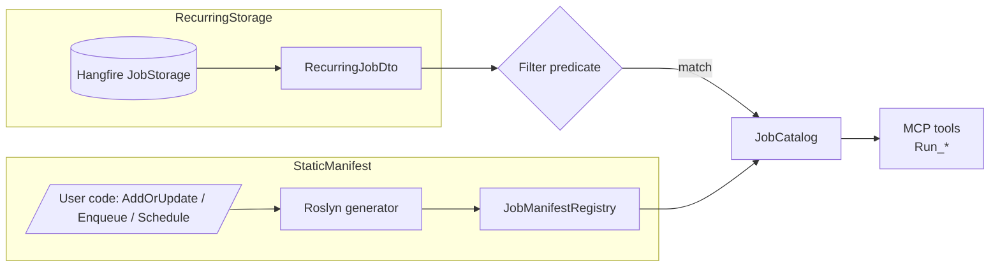

# Discovery Sources



`JobCatalog` discovers Hangfire jobs from one or both of:

| Source                       | What it sees                                                                                                                            | When to use                                                                                    |
| ---------------------------- | --------------------------------------------------------------------------------------------------------------------------------------- | ---------------------------------------------------------------------------------------------- |
| `RecurringStorage` (default) | `RecurringJobDto.Job` from Hangfire `JobStorage`.                                                                                       | Every recurring job is exposed as a tool.                                                      |
| `StaticManifest`             | Compile-time scan of `AddOrUpdate` / `Enqueue` / `Schedule` call sites via the optional `Nall.Hangfire.Mcp.Generator` source generator. | Helper methods you only ever one-shot enqueue, or jobs not yet registered as recurring.        |
| `All`                        | Union of both, deduped by `(DeclaringType, MethodInfo)`.                                                                                | Most apps.                                                                                     |

## Configure

```csharp
builder.Services.AddHangfireMcp(o =>
{
    o.Sources = JobDiscoverySources.All;            // default: RecurringStorage
    o.Filter  = rj => rj.Id.StartsWith("public.");  // optional storage filter
});
```

`Filter` runs against `RecurringJobDto` entries before scanning, so it only affects the `RecurringStorage` source. Use it to hide internal jobs from MCP without removing them from Hangfire.

## RecurringStorage

The default source reads from Hangfire's storage at startup and exposes every recurring job. Tool names follow the pattern `Run_<job-id>` with `.` and `-` replaced by `_`.

```csharp
recurringJobManager.AddOrUpdate<IReportJob>(
    "report.daily",
    j => j.GenerateAsync(2026, "pdf", null),
    Cron.Daily);
// → tool "Run_report_daily"
```

## StaticManifest

The compile-time manifest is emitted by `Nall.Hangfire.Mcp.Generator`. It scans Hangfire registration call sites in your code and produces a static `JobManifestRegistry`. Jobs registered only via `Enqueue` / `Schedule` (never as recurring) appear as tools when `Sources` includes `StaticManifest` or `All`.

Manifest-only tools use `Run_<TypeName>_<MethodName>`:

```csharp
backgroundJobClient.Enqueue<INotificationJob>(j => j.BroadcastAsync("hello"));
// → tool "Run_INotificationJob_BroadcastAsync"
```

See [Source Generator](/configuration/source-generator) for installation details.

## All

Use `JobDiscoverySources.All` to expose both recurring and one-shot jobs. Duplicates (same declaring type + method) are collapsed to a single tool.
