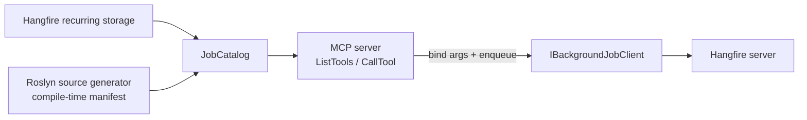
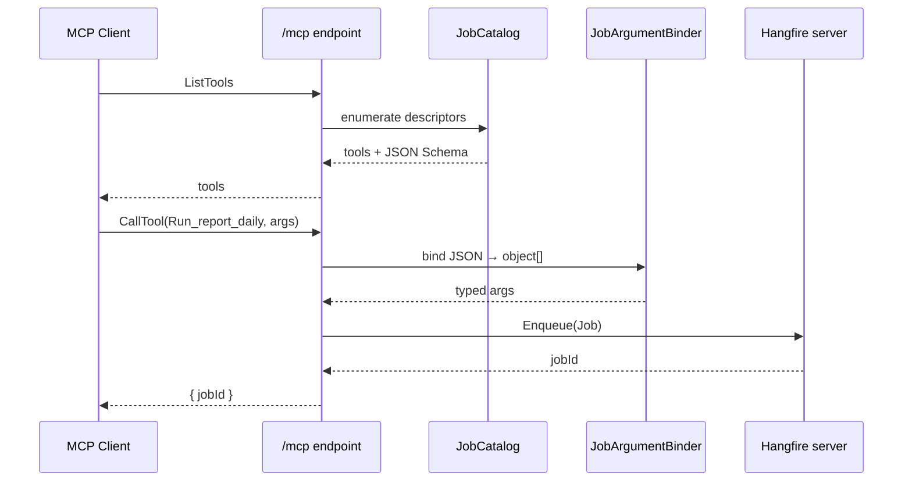

# What is Nall.Hangfire.Mcp?

`Nall.Hangfire.Mcp` is a remote [MCP](https://modelcontextprotocol.io) server that exposes [Hangfire](https://www.hangfire.io/) background jobs as MCP tools, in-process with the ASP.NET host that runs Hangfire. Any MCP-capable client (VS Code, Claude Desktop, custom agents) can list and invoke your jobs over a Streamable HTTP endpoint at `/mcp`.

## Design

- **In-process.** Runs inside the ASP.NET host that runs Hangfire. No out-of-process assembly loading.
- **Remote.** Streamable HTTP endpoint at `/mcp`. Any MCP client (VS Code, Claude Desktop, custom agents) can connect.
- **Zero ceremony.** No attributes, no shim interfaces — discovery reads what you already register with Hangfire.
- **Schema from `MethodInfo`.** JSON Schema generated per method. Required vs. optional respects both C# defaults and nullable annotations (`int?`, `string?`).

## Pipeline

1. **Discovery** — at startup, `JobCatalog` reads recurring job registrations from Hangfire storage and/or a compile-time manifest emitted by the source generator.
2. **Schema** — each job method becomes an MCP tool. Parameter types, C# defaults, and nullability annotations are translated to a JSON Schema (`required` vs optional).
3. **Invocation** — when an AI calls a tool, the library binds the JSON arguments, builds a `Hangfire.Common.Job`, and enqueues it via `IBackgroundJobClient`. The job runs normally through the Hangfire server.

## Tool call sequence

## Next steps

- [Getting Started](/getting-started) — install and wire up in three lines.
- [Discovery Sources](/configuration/sources) — choose between recurring storage and the compile-time manifest.
- [Authentication](/authentication) — layer OAuth 2.1 / OIDC on top of `MapHangfireMcp`.
