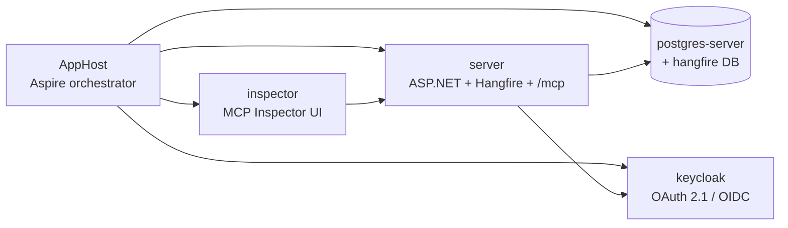
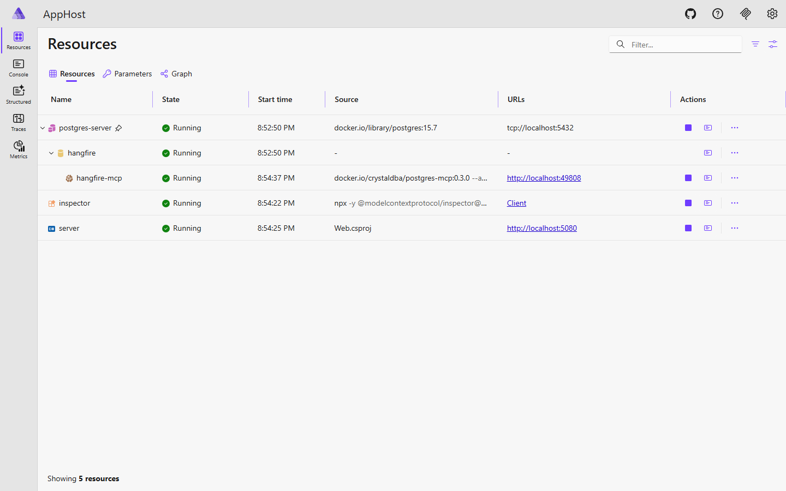

# Sample Overview

The `samples/` directory ships a runnable end-to-end demo: a Hangfire host with the MCP server enabled, the MCP Inspector pre-wired, PostgreSQL storage, and Keycloak for OAuth — all orchestrated by [.NET Aspire](https://learn.microsoft.com/dotnet/aspire).



## Projects

| Project              | Role                                                                                        |
| -------------------- | ------------------------------------------------------------------------------------------- |
| `samples/AppHost`    | Aspire orchestrator. Wires PostgreSQL, Keycloak, the web host, MCP Inspector, and the docs. |
| `samples/Web`        | ASP.NET host. Registers Hangfire, the dashboard, MCP, recurring jobs, OAuth, Swagger.       |
| `samples/HangfireJobs` | Job interfaces covering the full range of supported parameter shapes.                     |

## Run it

```bash
aspire run   # uses aspire.config.json -> samples/AppHost
```

Once resources are healthy:



| Resource                       | Role                                                                                   |
| ------------------------------ | -------------------------------------------------------------------------------------- |
| `server`                       | ASP.NET host — runs Hangfire server and exposes `/mcp`                                 |
| `postgres-server` / `hangfire` | Hangfire PostgreSQL storage                                                            |
| `keycloak`                     | OAuth 2.1 / OIDC provider with a pre-imported `HangfireMcp` realm                      |
| `inspector`                    | [MCP Inspector](https://github.com/modelcontextprotocol/inspector) pre-wired to `/mcp` |
| `hangfire-mcp`                 | Aspire-managed MCP proxy sidecar                                                       |

## AppHost wiring

```csharp
// samples/AppHost/Program.cs
var web = builder
    .AddProject<Projects.Web>("server")
    .WithReference(postgresDatabase)
    .WaitFor(postgresDatabase)
    .WithReference(keycloak)
    .WithReference(realm)
    .WaitFor(keycloak)
    .WithMcpServer("/mcp");

builder
    .AddMcpInspector("inspector", new McpInspectorOptions { InspectorVersion = "0.21.2" })
    .WithEnvironment("DANGEROUSLY_OMIT_AUTH", "true")
    .WithMcpServer(web);
```

`WithMcpServer("/mcp")` advertises the endpoint to Aspire's MCP infrastructure so the inspector and other tooling discover it automatically.

## Next

- [Sample jobs](/samples/jobs) — the job catalog the sample exposes.
- [MCP Inspector walkthrough](/samples/inspector) — list and call tools from the browser.
- [Hangfire dashboard](/samples/dashboard) — verify jobs were enqueued and ran.
