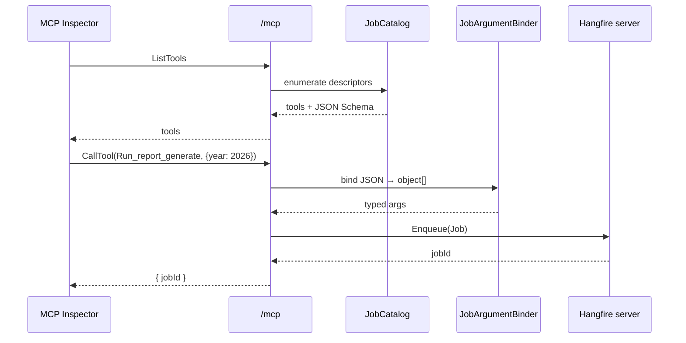

# MCP Inspector Walkthrough

The Aspire AppHost starts the [MCP Inspector](https://github.com/modelcontextprotocol/inspector) pre-connected to the `server` resource's `/mcp` endpoint. Open the inspector URL from `aspire ps` (or the Aspire dashboard under the `inspector` resource).

## Connect

The inspector opens with `http://localhost:5080/mcp` already filled in. Click **Connect**:

## List tools

Click **List Tools** on the **Tools** tab:

Each recurring job appears as a tool named `Run_<job-id>` (dots and hyphens replaced with underscores). Manifest-only tools use `Run_<TypeName>_<MethodName>`.

## Run a tool with parameters

Select `Run_send-message_text`, fill in `text`, then **Run Tool**:

The job is enqueued immediately:

## Defaults and optional parameters

`Run_report_generate` shows how `year` is required while `format` (has a C# default) and `since` (nullable) are optional:

## Tool-call sequence

