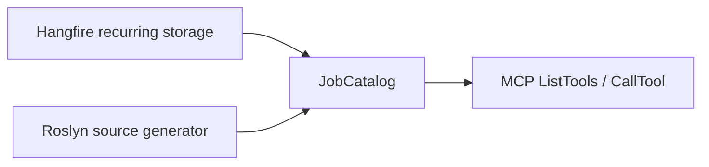

# Hangfire MCP — User Guide

`Nall.Hangfire.Mcp` exposes your Hangfire background jobs as [MCP](https://modelcontextprotocol.io) tools over a stateless Streamable HTTP endpoint (`/mcp`). Any MCP-capable AI client or inspector can discover and trigger jobs at runtime without writing extra glue code.

---

## How it works



1. **Discovery** — at startup, `JobCatalog` reads recurring job registrations from Hangfire storage and/or a compile-time manifest emitted by the source generator.
2. **Schema** — each job method becomes an MCP tool. Parameter types, C# defaults, and nullability annotations are translated to a JSON Schema (`required` vs optional).
3. **Invocation** — when an AI calls a tool, the library binds the JSON arguments, builds a `Hangfire.Common.Job`, and enqueues it via `IBackgroundJobClient`. The job runs normally through the Hangfire server.

## Quick setup

### 1. Register the MCP server

```csharp
// Program.cs
builder.Services.AddHangfireMcp(o =>
{
    // Default: RecurringStorage only.
    // Use All to also include compile-time manifest from the source generator.
    o.Sources = JobDiscoverySources.All;
});

// ...

app.MapHangfireMcp("/mcp");
```

### 2. Add the source generator (optional, for one-shot jobs)

```bash
dotnet add package Nall.Hangfire.Mcp.Generator
```

The NuGet package wires itself up as an analyzer automatically — no extra MSBuild required.

The generator scans `AddOrUpdate` / `Enqueue` / `Schedule` call sites at compile time and emits a static `JobManifestRegistry`. Jobs registered only via `Enqueue` (never as recurring) become tools when `Sources` includes `StaticManifest` or `All`.

---

## Discovery sources

| Source                       | What it discovers                                                 | When to use                                                                                |
| ---------------------------- | ----------------------------------------------------------------- | ------------------------------------------------------------------------------------------ |
| `RecurringStorage` (default) | Jobs registered with `AddOrUpdate` (read from storage at startup) | Most apps — zero config                                                                    |
| `StaticManifest`             | Jobs scanned at compile time by the source generator              | One-shot `Enqueue` / `Schedule` jobs, or offline manifest without running Hangfire storage |
| `All`                        | Union, deduplicated by `(DeclaringType, MethodInfo)`              | When you want both                                                                         |

```csharp
builder.Services.AddHangfireMcp(o => o.Sources = JobDiscoverySources.All);
```

See [Discovery Sources](/configuration/sources) for details.

---

## Parameter schema rules

| C# signature                   | JSON Schema                                           |
| ------------------------------ | ----------------------------------------------------- |
| `string name`                  | required string                                       |
| `string format = "pdf"`        | optional string (default applied server-side)         |
| `string? tag`                  | optional string (nullable reference)                  |
| `int? priority`                | optional integer (nullable value type)                |
| `ExportFormat format`          | required string enum (`"Csv"`, `"Json"`, `"Parquet"`) |
| `IReadOnlyList<string> tables` | required array of strings                             |
| `Message message`              | required object with inferred JSON Schema             |
| `DateTimeOffset? since`        | optional string (ISO 8601)                            |

---

## Try it

A runnable end-to-end demo (Aspire-orchestrated Hangfire + PostgreSQL + Keycloak + MCP Inspector) lives under `samples/`. See the [Sample](/samples/) section for the walkthrough.
