# Hangfire MCP — User Guide

`Nall.Hangfire.Mcp` exposes your Hangfire background jobs as [MCP](https://modelcontextprotocol.io) tools over a stateless Streamable HTTP endpoint (`/mcp`). Any MCP-capable AI client or inspector can discover and trigger jobs at runtime without writing extra glue code.

---

## How it works

```
Hangfire recurring storage ──┐
                              ├─► JobCatalog ──► MCP ListTools / CallTool
Roslyn source generator ──────┘
```

1. **Discovery** — at startup, `JobCatalog` reads recurring job registrations from Hangfire storage and/or a compile-time manifest emitted by the source generator.
2. **Schema** — each job method becomes an MCP tool. Parameter types, C# defaults, and nullability annotations are translated to a JSON Schema (`required` vs optional).
3. **Invocation** — when an AI calls a tool, the library binds the JSON arguments, builds a `Hangfire.Common.Job`, and enqueues it via `IBackgroundJobClient`. The job runs normally through the Hangfire server.

---

## Quick setup

### 1. Register the MCP server

```csharp
// Program.cs
builder.Services.AddHangfireMcp(o =>
{
    // Default: RecurringStorage only.
    // Use All to also include compile-time manifest from the source generator.
    o.Sources = JobDiscoverySources.All;
});

// ...

app.MapHangfireMcp("/mcp");
```

### 2. Add the source generator (optional, for one-shot jobs)

```xml
<!-- Web.csproj -->
<ItemGroup>
  <ProjectReference Include="..\Nall.Hangfire.Mcp.Generator\..."
                    OutputItemType="Analyzer"
                    ReferenceOutputAssembly="false" />
</ItemGroup>
```

The generator scans `AddOrUpdate` / `Enqueue` / `Schedule` call sites at compile time and emits a static `JobManifestRegistry`. Jobs registered only via `Enqueue` (never as recurring) become tools when `Sources` includes `StaticManifest` or `All`.

---

## Running the sample

The sample uses [.NET Aspire](https://learn.microsoft.com/dotnet/aspire) to orchestrate Hangfire + PostgreSQL + the MCP Inspector.

```pwsh
aspire run   # uses aspire.config.json -> samples/AppHost
```

After a few seconds all resources become healthy:


| Resource                       | Role                                                                                   |
| ------------------------------ | -------------------------------------------------------------------------------------- |
| `server`                       | ASP.NET host — runs Hangfire server and exposes `/mcp`                                 |
| `postgres-server` / `hangfire` | Hangfire PostgreSQL storage                                                            |
| `inspector`                    | [MCP Inspector](https://github.com/modelcontextprotocol/inspector) pre-wired to `/mcp` |
| `hangfire-mcp`                 | Aspire-managed MCP proxy sidecar                                                       |

---

## Sample jobs

`samples/HangfireJobs` defines six job interfaces that cover the full range of supported parameter shapes:

| Recurring ID            | Interface          | Method                                                                         | Parameters                    |
| ----------------------- | ------------------ | ------------------------------------------------------------------------------ | ----------------------------- |
| `time.execute`          | `ITimeJob`         | `ExecuteAsync()`                                                               | none                          |
| `send-message.text`     | `ISendMessageJob`  | `ExecuteAsync(string text)`                                                    | one required string           |
| `send-message.envelope` | `ISendMessageJob`  | `ExecuteAsync(Message message)`                                                | one required complex object   |
| `report.generate`       | `IReportJob`       | `GenerateAsync(int year, string format = "pdf", DateTimeOffset? since = null)` | one required + two optional   |
| `data.export`           | `IDataExportJob`   | `ExportAsync(ExportFormat format, IReadOnlyList<string> tables)`               | enum + string array           |
| `maint.rebuild-indexes` | `MaintenanceJob`   | `RebuildIndexesAsync(string schema = "public")`                                | one optional with default     |
| `notify.dispatch`       | `INotificationJob` | `NotifyAsync(string channel, string? message, int? priority)`                  | required + nullable optionals |

Plus three **manifest-only** tools (discovered from one-shot `Enqueue` calls by the source generator):

- `Run_INotificationJob_BroadcastAsync`
- `Run_IReportJob_PreviewAsync`
- `Run_MaintenanceJob_VacuumAsync`

---

## Using the MCP Inspector

The Aspire AppHost starts the MCP Inspector pre-connected to the `server` resource's `/mcp` endpoint. Open the inspector URL shown in `aspire ps` output (or on the Aspire dashboard under the `inspector` resource).

### Connect

The inspector opens with the URL `http://localhost:5080/mcp` already filled in. Click **Connect**:

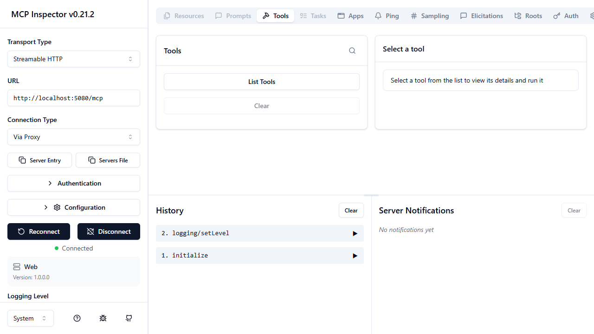

### List tools

Click **List Tools** on the **Tools** tab:

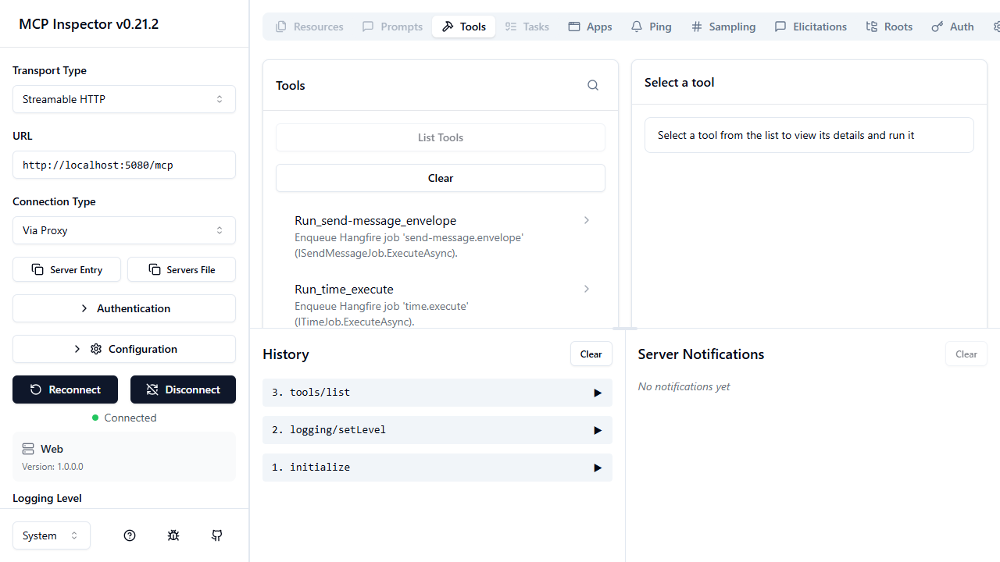

Each recurring job appears as a tool named `Run_<job-id>` (dots and hyphens replaced with underscores). Manifest-only tools use `Run_<TypeName>_<MethodName>`.

### Run a parameterless tool

Select `Run_time_execute` and click **Run Tool**:

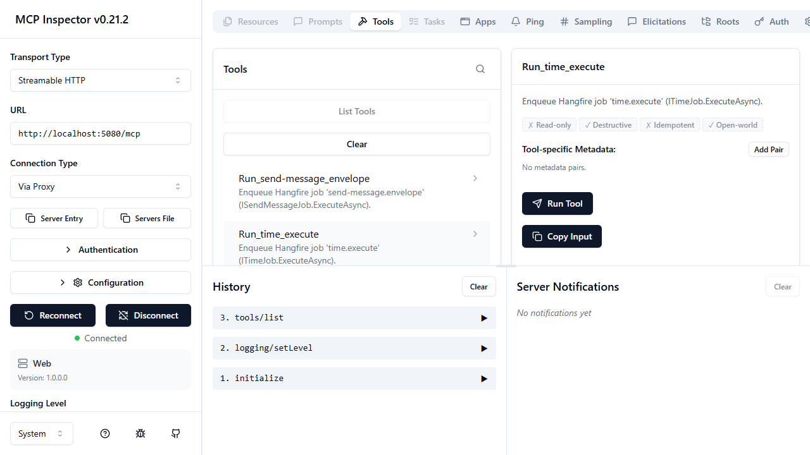

The result confirms the job was enqueued:

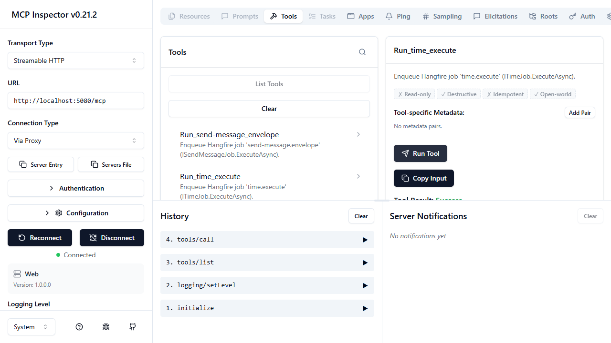

### Run a tool with parameters

Select `Run_send-message_text`, fill in the `text` field, then click **Run Tool**:

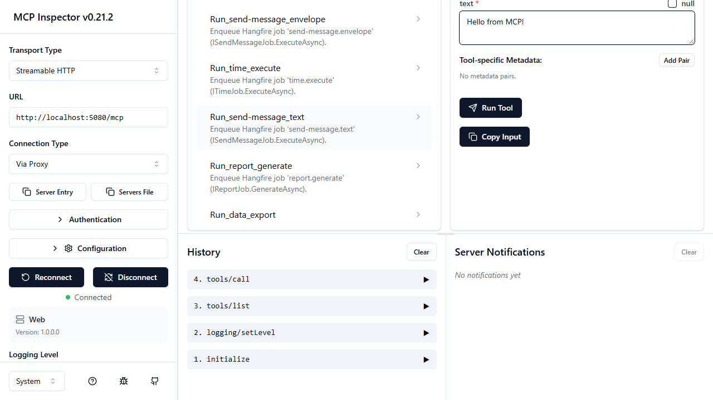

The job is enqueued immediately:

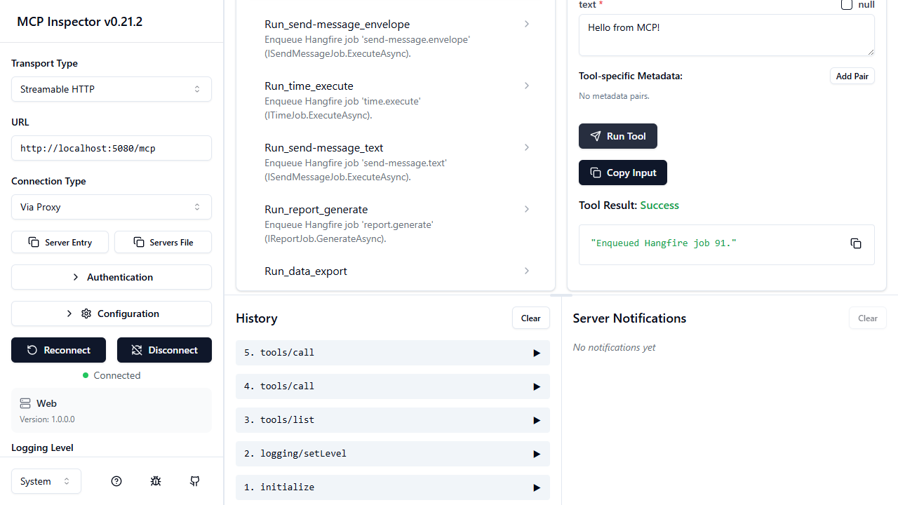

### Tools with defaults and optional parameters

`Run_report_generate` shows how `year` is required while `format` (has a C# default) and `since` (nullable) are optional:

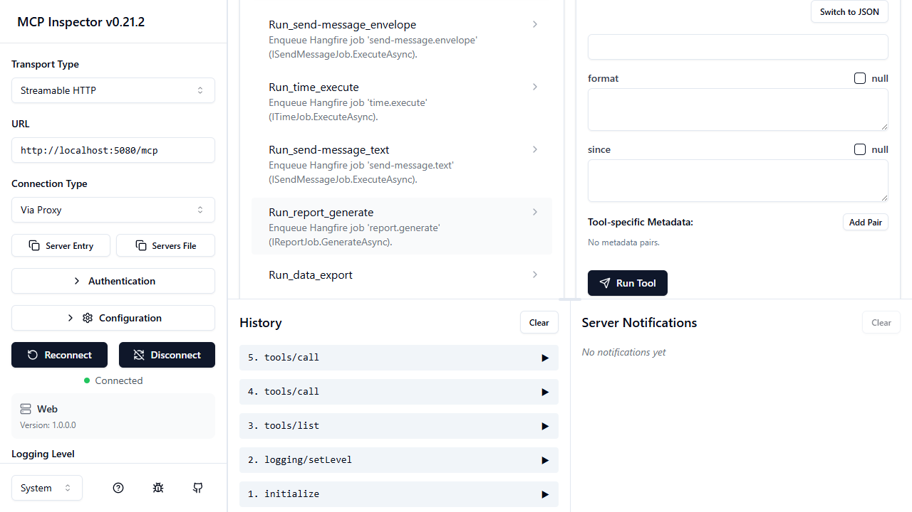

---

## Verifying jobs in the Hangfire dashboard

`MapHangfireDashboard` is also registered in the sample. Navigate to `http://localhost:5080`:

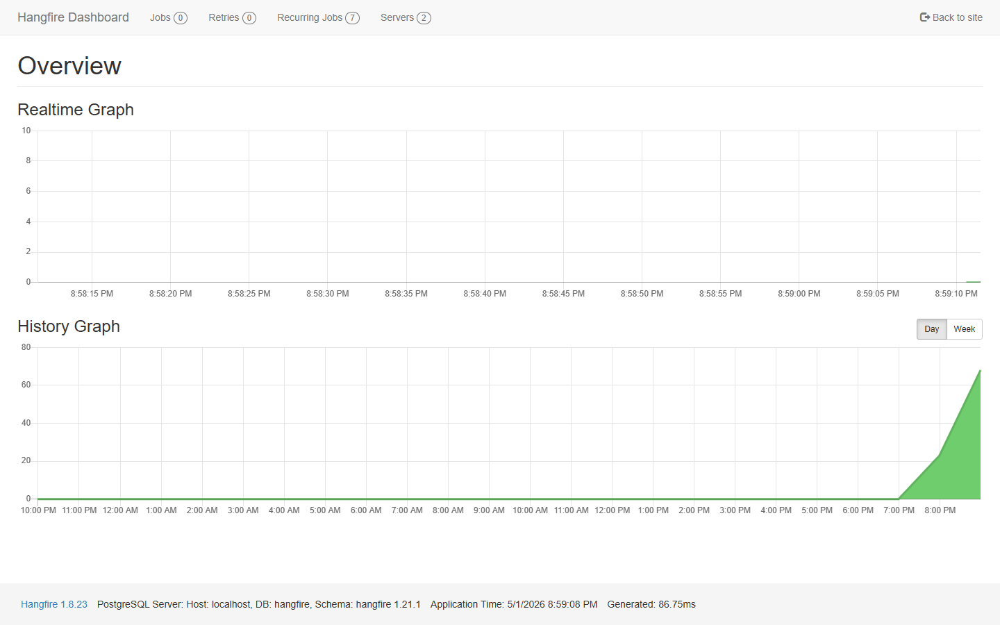

**Recurring Jobs** shows all seven registered schedules:

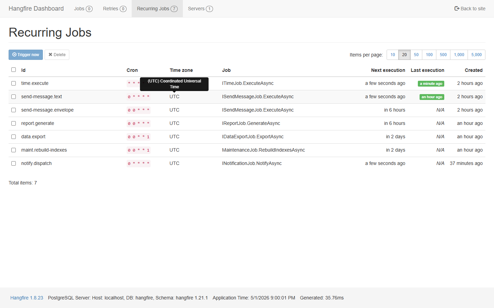

**Succeeded Jobs** lists every completed execution. Jobs triggered via MCP appear alongside normally scheduled ones:

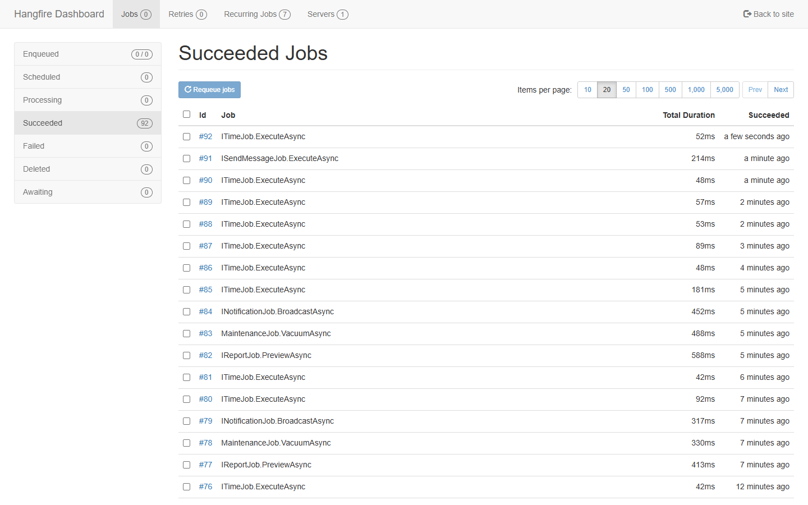

Click any job to inspect its arguments, state transitions, and timing:

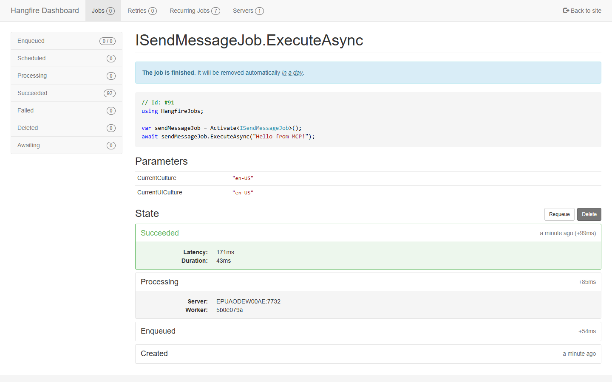

---

## Discovery sources

| Source                       | What it discovers                                                 | When to use                                                                                |
| ---------------------------- | ----------------------------------------------------------------- | ------------------------------------------------------------------------------------------ |
| `RecurringStorage` (default) | Jobs registered with `AddOrUpdate` (read from storage at startup) | Most apps — zero config                                                                    |
| `StaticManifest`             | Jobs scanned at compile time by the source generator              | One-shot `Enqueue` / `Schedule` jobs, or offline manifest without running Hangfire storage |
| `All`                        | Union, deduplicated by `(DeclaringType, MethodInfo)`              | When you want both                                                                         |

```csharp
builder.Services.AddHangfireMcp(o => o.Sources = JobDiscoverySources.All);
```

---

## Parameter schema rules

| C# signature                   | JSON Schema                                           |
| ------------------------------ | ----------------------------------------------------- |
| `string name`                  | required string                                       |
| `string format = "pdf"`        | optional string (default applied server-side)         |
| `string? tag`                  | optional string (nullable reference)                  |
| `int? priority`                | optional integer (nullable value type)                |
| `ExportFormat format`          | required string enum (`"Csv"`, `"Json"`, `"Parquet"`) |
| `IReadOnlyList<string> tables` | required array of strings                             |
| `Message message`              | required object with inferred JSON Schema             |
| `DateTimeOffset? since`        | optional string (ISO 8601)                            |

---

## Aspire integration (AppHost wiring)

```csharp
// samples/AppHost/Program.cs
var web = builder
    .AddProject<Projects.Web>("server")
    .WithReference(postgresDatabase)
    .WaitFor(postgresDatabase)
    .WithMcpServer("/mcp");   // expose /mcp to Aspire MCP infrastructure

builder
    .AddMcpInspector("inspector", new McpInspectorOptions { InspectorVersion = "0.21.2" })
    .WithMcpServer(web)
    .WithEnvironment("DANGEROUSLY_OMIT_AUTH", "true");
```

`WithMcpServer("/mcp")` tells Aspire the project exposes an MCP endpoint, enabling the inspector and Aspire's built-in MCP tooling to discover it automatically.
